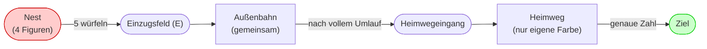
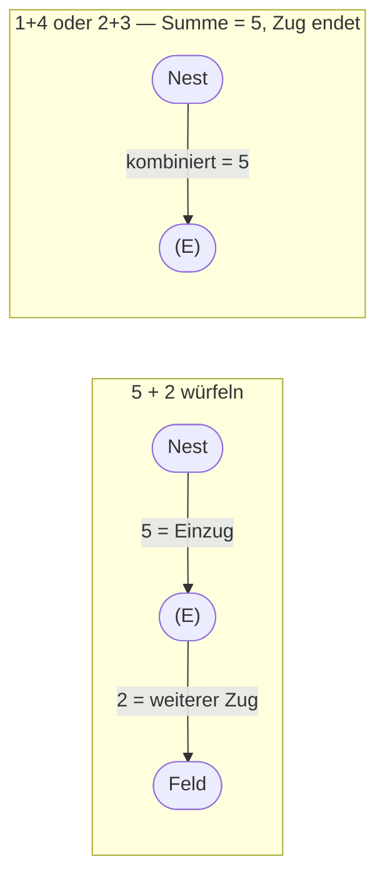
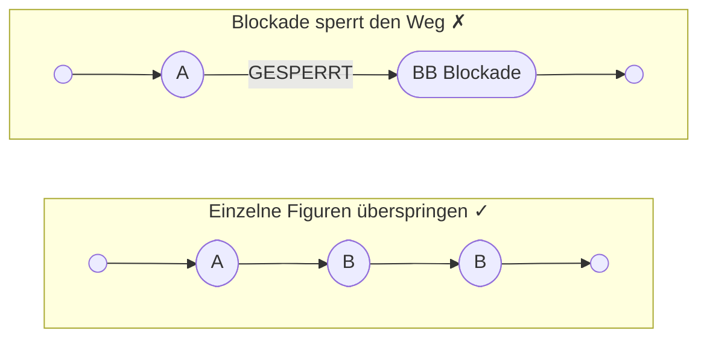
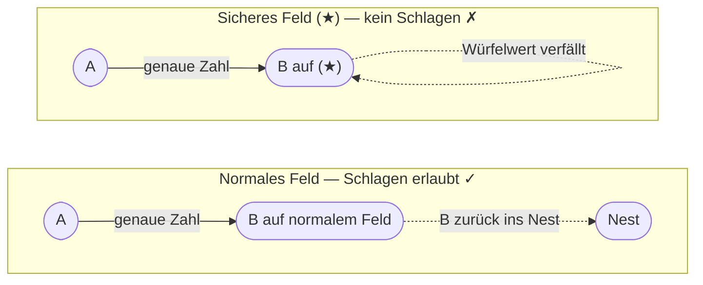
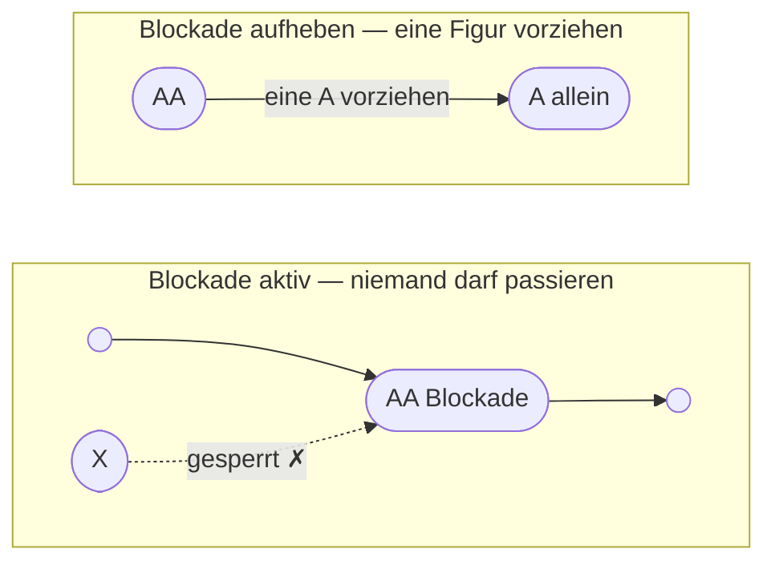
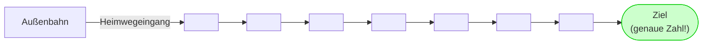
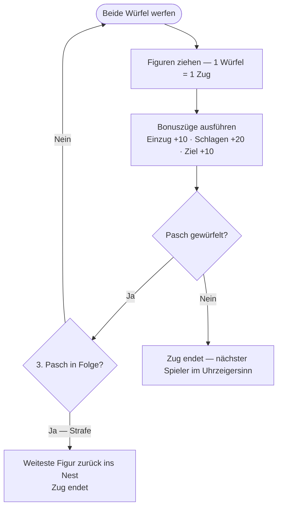

# PACHEESI — Vollständige Spielregeln

## Ziel und Spielmaterial

**Ziel:** Sei der Erste, der alle vier Figuren ins **Ziel** bringt.

**Inhalt:** Spielbrett, 16 Figuren (4 je Farbe), 2 Würfel.

## Das Spielbrett

| Symbol | Bedeutung |
| ------ | --------- |
| **(E)** | Einzugsfeld — erstes Feld auf der Außenbahn |
| **(★)** | Sicheres Feld — kein Schlagen erlaubt (12 insgesamt: 4 Einzug, 4 Heimweg, 4 normal) |
| **Ziel** | Zielfeld — genaue Augenzahl erforderlich |

**Nest:** Der farbige Startbereich, in dem deine 4 Figuren warten.

**Einzugsfeld (E):** Das farbige Feld auf der Außenbahn, auf das eine Figur beim Einzug aus dem Nest tritt. Auch ein sicheres Feld.

**Außenbahn:** Der gemeinsame Rundkurs mit 68 Feldern, den alle Figuren durchlaufen.

**Heimweg:** Die farbige Innenbahn, die nur deine Figuren nach Verlassen der Außenbahn benutzen dürfen.

**Ziel:** Das Schlussfeld am Ende deines Heimwegs.

**Sichere Felder (★):** 12 markierte Felder, auf denen kein Schlagen erlaubt ist:

- **4 Einzugsfelder:** Wo Figuren die Außenbahn betreten (Grün 5, Blau 22, Rot 39, Gelb 56)
- **4 Heimwegeingangsfelder:** Wo Figuren die Außenbahn verlassen (Grün 68, Blau 17, Rot 34, Gelb 51)
- **4 Normale Sicherheitsfelder:** Keine besondere Funktion; nur Schutz (Felder 12, 29, 46, 63)

**Blockade:** Zwei gleichfarbige Figuren auf einem Feld — niemand darf
passieren.

## Die Außenbahn — Feldnummerierung

Die Außenbahn besteht aus **68 nummerierten Feldern**, die sich gegen den Uhrzeigersinn um das Brett verteilen. Jede Farbe hat ein bestimmtes Einzugsfeld und einen Heimwegausstieg.

**Außenbahn-Layout nach Farbe:**

| Farbe | Einzugsfeld | Felder | Heimwegexit |
| --- | --- | --- | --- |
| **Grün** | 5 ★ | 1–68 | 68 ★ |
| **Blau** | 22 ★ | 18–22, 23–68 | 17 ★ |
| **Rot** | 39 ★ | 35–39, 40–68 | 34 ★ |
| **Gelb** | 56 ★ | 52–56, 57–68 | 51 ★ |

**Ablauf der Feldnummerierung** (gegen den Uhrzeigersinn):

- Grüne Figuren treten bei **Feld 5** ein und reisen durch die Felder 6–68, dann verlass sie bei Feld **68** die Außenbahn in Grüns Heimweg.
- Blaue Figuren treten bei **Feld 22** ein und reisen durch die Felder 23–68, zurück durch 1–21, dann verlassen sie bei Feld **17** die Außenbahn in Blaus Heimweg.
- Rote Figuren treten bei **Feld 39** ein und reisen durch die Felder 40–68, zurück durch 1–38, dann verlassen sie bei Feld **34** die Außenbahn in Rots Heimweg.
- Gelbe Figuren treten bei **Feld 56** ein und reisen durch die Felder 57–68, zurück durch 1–55, dann verlassen sie bei Feld **51** die Außenbahn in Gelbs Heimweg.

**Alle 12 sicheren Felder auf der Außenbahn:**

| Kategorie | Felder |
| --- | --- |
| Einzugsfelder ★ | 5 (Grün), 22 (Blau), 39 (Rot), 56 (Gelb) |
| Heimwegaustrittsfelder ★ | 68 (Grün), 17 (Blau), 34 (Rot), 51 (Gelb) |
| Normale Sicherheitsfelder ★ | 12, 29, 46, 63 |

## Aufstellung und erster Spieler

Jeder Spieler wählt eine Farbe und stellt alle 4 Figuren ins Nest.

Alle würfeln; der höchste Gesamtwert beginnt.

**Wichtige Richtungsklarstellung:**

- **Figurenbewegung:** Alle Figuren bewegen sich **gegen den Uhrzeigersinn** um die Außenbahn (den Feldnummern 1 → 2 → 3 ... → 68 → wiederholen folgend).
- **Spielerreihenfolge:** Spieler sind an der Reihe in **Uhrzeigersinn** — nach deinem Zug gehen die Würfel an deinen **linken Nachbarn**.

Das bedeutet, dass die Richtung der Figurenbewegung und die Spielerreihenfolge **entgegengesetzt** sind: Figuren gehen so, das Zugrecht/Spielerreihenfolge gehen anders herum.

## Der Spielzug

1. Wirf beide Würfel.
2. Bewege deine Figuren — jeder Würfel ist ein eigenständiger Zug:
   - Eine Figur mit dem einen, eine andere mit dem zweiten Würfel,
     **oder**
   - Dieselbe Figur mit beiden Würfeln nacheinander.
3. Nutze alle Züge, die legal möglich sind. Ist nur ein Würfelwert
   spielbar, muss dieser genutzt werden.
4. Führe alle in diesem Zug verdienten Bonuszüge aus (Details unten).
5. Bei einem Pasch darf erneut gewürfelt werden
   (siehe [Pasch](#pasch-doublett)).

## Einzug aus dem Nest — Die „5"-Regel

Um eine Figur vom Nest auf dein **Einzugsfeld** zu bringen, muss eine
**5** gewürfelt werden — entweder auf einem einzelnen Würfel oder als
Summe beider Würfel.

> **Hinweis:** Bonuszüge dürfen **nicht** zum Einzug genutzt werden.
> Nur eine gewürfelte **5** zieht eine Figur aus dem Nest.

## Zugregeln

- **Richtung:** Den Pfeilen auf dem Brett folgen
  (üblich: gegen den Uhrzeigersinn).
- **Aufteilung:** Die Würfelwerte dürfen auf verschiedene Figuren
  aufgeteilt werden. Jeder Würfelwert gilt für eine Figur als Ganzes —
  er kann nicht weiter aufgesplittet werden.
- **Genaue Zahl:** Jeder Würfelwert muss vollständig gespielt werden,
  sofern dies regelkonform möglich ist.
- **Überholen:** Einzelne Figuren (eigen oder gegnerisch) dürfen
  übersprungen werden. Eine **Blockade** darf nicht passiert werden.

## Sichere Felder

Es gibt **12 sichere Felder** auf der Außenbahn, auf denen kein Schlagen erlaubt ist:

| Typ | Felder | Funktion | Mit ★ gekennzeichnet |
| --- | --- | --- | --- |
| Einzugsfelder | 5, 22, 39, 56 | Wo Figuren die Außenbahn betreten | Ja |
| Heimwegeingangsfelder | 68, 17, 34, 51 | Wo Figuren die Außenbahn verlassen | Ja |
| Normale Sicherheitsfelder | 12, 29, 46, 63 | Keine besondere Funktion; nur Schutz | Ja |

**Regeln für sichere Felder:**

- Auf keinem sicheren Feld (★) darf **geschlagen** werden.
- Ist der einzige erreichbare Landeplatz ein sicheres Feld mit
  gegnerischer Figur, verfällt dieser Würfelwert.

## Schlagen und Bonuszüge

**Schlagen:** Mit exakter Augenzahl auf eine einzelne gegnerische Figur
auf einem normalen Feld landen → Gegner kommt zurück ins **Nest**.

| Ereignis | Bonuszüge |
| --- | --- |
| Figur aus dem Nest einziehen | Beliebige Figur **10** Felder |
| Gegnerische Figur schlagen | Beliebige Figur **20** Felder |
| Figur ins Ziel bringen | Beliebige Figur **10** Felder |

**Regeln für Bonuszüge:**

- Bonuszüge werden **nach** allen Würfelzügen ausgeführt.
- Jeder Bonus = ein Zug für eine Figur (nicht aufteilbar).
- Alle normalen Regeln gelten weiterhin (Blockaden, genaue Zahl usw.).
- Kann der volle Bonuszug nicht genutzt werden, **verfällt** er.

## Blockaden

Stehen zwei gleichfarbige Figuren auf einem Feld, bilden sie eine
**Blockade**.

**Blockade-Regeln:**

- Blockaden können auf **jedem** Feld entstehen (auch sicheren Feldern).
- Keine Figur darf eine Blockade betreten oder überschreiten.
- Es ist **nicht erlaubt**, beide Blockade-Figuren in einem Zug so
  vorzuziehen, dass die Blockade als Einheit eine andere Figur
  überholt.

## Heimweg und Ziel

**Beispiel — Figur ist noch 2 Felder vom Ziel entfernt:**

- **Würfelt 3:** Überschießen verboten — Würfelwert für diese Figur
  verfällt; nutze ihn für eine andere Figur, falls möglich.
- **Würfelt 2:** Genau im Ziel — **10** Bonusfelder!
- **Würfelt 1:** Figur rückt 1 Feld vor (noch nicht im Ziel).

**Weitere Regeln:**

- Nur **deine** Figuren dürfen in **deinen** Heimweg eintreten.
- Im Heimweg wird **nicht** geschlagen.

## Pasch (Doublett)

Bei einem Pasch erhältst du **vier Züge**: obere Augenzahl + untere
Augenzahl (gegenüberliegende Seiten eines Würfels ergeben stets **7**).

| Wurf | Vier verfügbare Züge |
| ---- | -------------------- |
| 6 + 6 | 6, 6, 1, 1 |
| 5 + 5 | 5, 5, 2, 2 |
| 4 + 4 | 4, 4, 3, 3 |
| 3 + 3 | 3, 3, 4, 4 |
| 2 + 2 | 2, 2, 5, 5 |
| 1 + 1 | 1, 1, 6, 6 |

- Verteile die vier Züge beliebig auf deine Figuren.
- Nach den Zügen (und Bonuszügen) **würfelst du erneut**.

**Dreifach-Pasch-Strafe:**

Beim dritten Pasch in Folge innerhalb eines Zuges:

- Die am weitesten vorgeschrittene Figur kommt zurück ins **Nest**.
- Der Zug endet sofort.
- Sind keine Figuren auf dem Brett, entfällt die Strafe.

## Zugzwang und Zugverlust

- Ist ein Zug möglich, **muss** er ausgeführt werden — auch wenn er
  nachteilig ist.
- Wenn nur ein Würfelwert legal spielbar ist, muss dieser genutzt
  werden.
- Wenn ein Würfelwert oder Bonuszug nicht legal nutzbar ist,
  **verfällt** er.

## Zugablauf (Kurzübersicht)

## Spielende

Der **erste Spieler**, der alle vier Figuren ins **Ziel** bringt,
gewinnt.

Für weitere Plätze kann mit den verbleibenden Spielern weiter gespielt
werden.

---

> Hausregeln können abweichen — bei Zweifeln gelten die Regeln des
> eigenen Spielbrettes. Viel Spaß!
