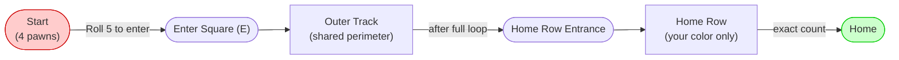
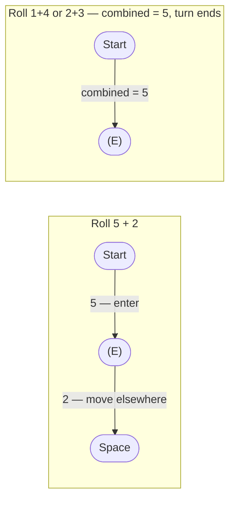
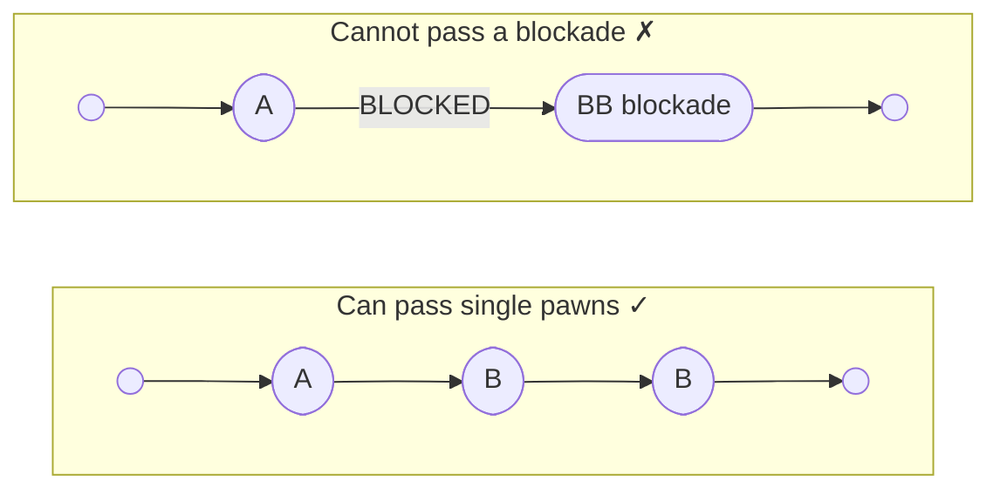
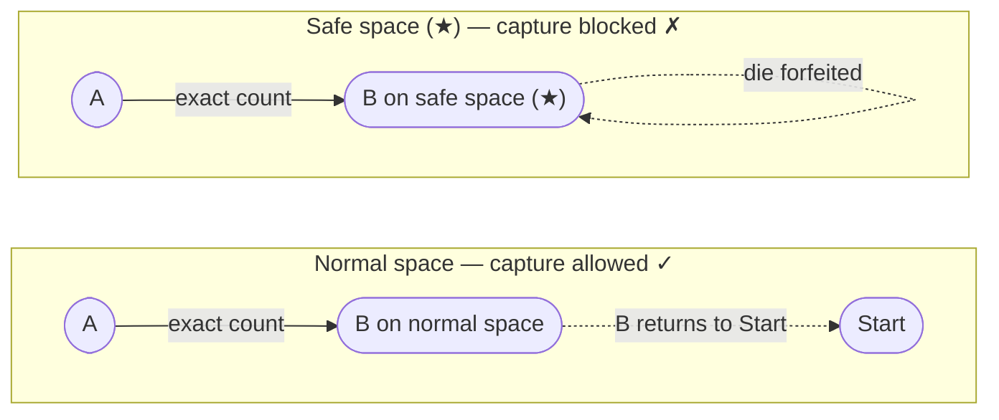
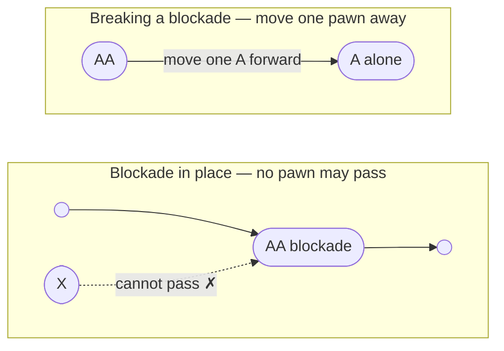
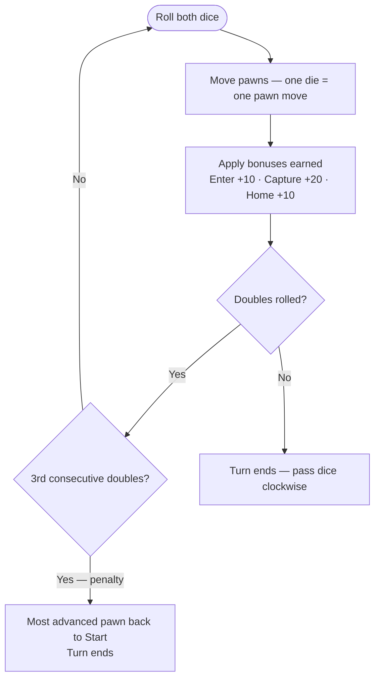

# PACHEESI — Complete Rules

## Objective and Components

**Goal:** Be the first to move all four of your pawns from your **Start** to
your **Home**.

**Components:** Board, 16 pawns (4 per color), 2 dice.

## The Board at a Glance

| Symbol | Meaning |
| ------ | ------- |
| **(E)** | Enter square — where pawns first step onto the outer track from Start |
| **(★)** | Safe space — no captures allowed here (12 total: 4 entry, 4 home-row entry, 4 plain) |
| **Home** | Final destination — exact count required |

**Start:** The colored area holding your 4 pawns before entering the track.

**Enter (E):** Your colored square on the outer track where a pawn first arrives (using a rolled 5). Also a safe space.

**Outer track:** The shared perimeter path every pawn travels around the board (68 spaces total).

**Home row:** Your color's inner path that only your pawns may use after exiting the outer track.

**Home:** The final space at the end of your home row.

**Safe spaces (★):** 12 marked spaces where captures cannot occur:

- **4 Entry squares:** Where pawns enter the outer track (Green 5, Blue 22, Red 39, Yellow 56)
- **4 Home-row entry squares:** Where pawns exit the outer track to enter home (Green 68, Blue 17, Red 34, Yellow 51)
- **4 Plain safety squares:** No special function; no captures allowed (fields 12, 29, 46, 63)

**Blockade:** Two pawns of the same color on the same space — nobody can pass.

## The Outer Track — Field Numbering

The outer track consists of **68 numbered fields** arranged counter-clockwise around the board. Each color has a designated entry point and home-row exit point.

**Outer track layout by color:**

| Color | Entry Field | Fields | Home Exit |
| --- | --- | --- | --- |
| **Green** | 5 ★ | 1–68 | 68 ★ |
| **Blue** | 22 ★ | 18–22, 23–68 | 17 ★ |
| **Red** | 39 ★ | 35–39, 40–68 | 34 ★ |
| **Yellow** | 56 ★ | 52–56, 57–68 | 51 ★ |

**Field numbering flow** (counter-clockwise):

- Green pawns enter at **field 5** and travel through fields 6–68, then exit at field **68** into Green's home row.
- Blue pawns enter at **field 22** and travel through fields 23–68, wrapping back through fields 1–21, then exit at field **17** into Blue's home row.
- Red pawns enter at **field 39** and travel through fields 40–68, wrapping back through fields 1–38, then exit at field **34** into Red's home row.
- Yellow pawns enter at **field 56** and travel through fields 57–68, wrapping back through fields 1–55, then exit at field **51** into Yellow's home row.

**All 12 safe spaces on the outer track:**

| Category | Fields |
| --- | --- |
| Entry fields ★ | 5 (Green), 22 (Blue), 39 (Red), 56 (Yellow) |
| Home-row exits ★ | 68 (Green), 17 (Blue), 34 (Red), 51 (Yellow) |
| Plain safety fields ★ | 12, 29, 46, 63 |

## Setup and First Player

Each player picks a color and places all 4 pawns in their **Start**.

Roll both dice; highest total goes first.

**Important directional clarification:**

- **Pawn movement:** All pawns travel **counter-clockwise** around the outer track (following field numbers 1 → 2 → 3 ... → 68 → repeat).
- **Player turn order:** Players take turns in **clockwise** direction — after your turn ends, the dice pass to your **left neighbor**.

This means the board direction and the turn direction are **opposite**: pawns go one way, player's turns go the other way.

## Taking a Turn (Core Flow)

1. Roll both dice.
2. Use the dice to move your pawns. Each die is a separate move:
   - Move one pawn using one die **and** a second pawn using the other die, **or**
   - Move the same pawn with both dice (first one, then the other).
3. Use all moves you can legally make. If only one die can be used, you must
   use it.
4. Apply any bonuses you earned this turn (details below).
5. If you rolled doubles, take another roll (see [Doubles](#doubles-doublets) section).

## Entering a Pawn from Start — The "5" Rule

To move a pawn from **Start** onto your **Enter** square, you must roll a
total of **5**.

> **Note:** Bonuses **cannot** be used to enter a pawn from Start. Only a
> rolled **5** can enter a pawn.

## Movement Basics

- **Direction:** Follow the arrows on your board (commonly counterclockwise).
- **Splitting:** You may split the dice between any pawns, but each die is
  one complete move for a single pawn — you cannot break a die's number
  into smaller pieces.
- **Exact counts:** You must move the full value of a die unless blocked.
- **Passing:** You may pass over your own or opponents' single pawns, but
  cannot pass a blockade.

## Safe Spaces

There are **12 safe spaces** on the outer track where captures are not allowed:

| Type | Spaces | Function | Marked as ★ |
| --- | --- | --- | --- |
| Entry squares | 5, 22, 39, 56 | Where pawns first enter the outer track | Yes |
| Home-row entry squares | 68, 17, 34, 51 | Where pawns exit the outer track to home | Yes |
| Plain safety squares | 12, 29, 46, 63 | No special function; safe only | Yes |

**Safe space rules:**

- You may **not** capture an opponent on any safe space (★).
- If your only valid landing would place you on an opponent sitting on a safe space,
  that die cannot be used.

## Captures and Bonuses

**Capture:** Land by exact count on a single opponent pawn on a non-safe space →
opponent returns to **Start**.

| Event | Bonus movement |
| --- | --- |
| Enter pawn from Start | Move any pawn **10** spaces |
| Capture an opponent pawn | Move any pawn **20** spaces |
| Move a pawn into Home | Move any pawn **10** spaces |

**Bonus rules:**

- Take bonuses **after** all die moves are complete.
- Each bonus = one move for one pawn (not splittable).
- All normal rules apply (blockades, exact count, etc.).
- If you cannot use the full bonus, you **forfeit** it.

## Blockades

Two same-color pawns on one space = **BLOCKADE**.

**Blockade rules:**

- Blockades can be formed on **any** space (even safe ones).
- No pawn may land on **or** pass a blockade.
- You cannot move **both** blockade pawns forward in the same turn in a way
  that would "carry" the blockade past a pawn that otherwise couldn't pass it.

## Home Row and Going Home

**Example — pawn is 2 spaces from Home:**

- **Roll 3:** Cannot overshoot — die forfeited for this pawn; use die
  elsewhere if possible.
- **Roll 2:** Lands exactly in Home — take **10** bonus!
- **Roll 1:** Moves 1 space closer (not home yet).

**Additional rules:**

- Only **your** pawns may enter **your** home row.
- **No captures** in the home row.

## Doubles (Doublets)

Rolling doubles gives you **four moves**: top faces + bottom faces
(opposite sides of a die sum to **7**).

| Roll | Four moves available |
| ------ | --------------------- |
| 6 + 6 | 6, 6, 1, 1 |
| 5 + 5 | 5, 5, 2, 2 |
| 4 + 4 | 4, 4, 3, 3 |
| 3 + 3 | 3, 3, 4, 4 |
| 2 + 2 | 2, 2, 5, 5 |
| 1 + 1 | 1, 1, 6, 6 |

- Distribute the four moves across any pawns you like.
- After moves (and bonuses), **roll again**.

**Three doubles in a row penalty:**

On your 3rd consecutive doubles in one turn:

- Move your **most advanced pawn** back to **Start**.
- Your turn ends immediately.
- If no pawns are on the board, no penalty applies.

## Forced Moves and Forfeits

- If a move is possible, you **must** make it — even if disadvantageous.
- If only one die can be used legally, you must use it.
- If a die or bonus cannot be legally used at all, you **forfeit** it.

## Full Turn Summary

## Winning

The **first player** to move all four pawns into **Home** wins.

For multi-place finishes, continue play for remaining places if desired.

---

> House rules vary — if your board's printed rules differ from these, defer to those.
> Enjoy your game!
